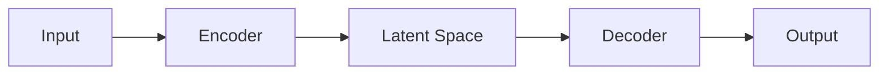

## Mathematics

Inline math: The loss function $\mathcal{L}(\theta) = -\mathbb{E}[\log p_\theta(x)]$ is minimized during training.

Display math:

$$
\nabla_\theta \mathcal{L}(\theta) = -\mathbb{E}_{x \sim p_{\text{data}}} \left[ \nabla_\theta \log p_\theta(x) \right]
$$

## Code

```python
import torch
import torch.nn as nn

class TransformerBlock(nn.Module):
    def __init__(self, d_model: int, n_heads: int):
        super().__init__()
        self.attn = nn.MultiheadAttention(d_model, n_heads)
        self.norm = nn.LayerNorm(d_model)

    def forward(self, x):
        attn_out, _ = self.attn(x, x, x)
        return self.norm(x + attn_out)
```

## Diagrams



## Blockquotes

> "The key insight is that language models can be seen as implicit world models."
> — Sébastien Bubeck et al., *Sparks of AGI* [^1]

## Footnotes

This is a claim that needs a citation[^1].

[^1]: Bubeck et al. "Sparks of Artificial General Intelligence." *arXiv:2303.12712*, 2023.

---

<details class="citation-block">
<summary>Cited as</summary>

> Laabsi, Zakaria. "Hello World — Rendering Test." *zlaabsi.github.io*, Mar 2026.

```bibtex
@article{laabsi2026hello,
  title   = "Hello World — Rendering Test",
  author  = "Laabsi, Zakaria",
  journal = "zlaabsi.github.io",
  year    = "2026",
  month   = "Mar",
  url     = "https://zlaabsi.github.io/posts/hello-world/"
}
```

</details>
